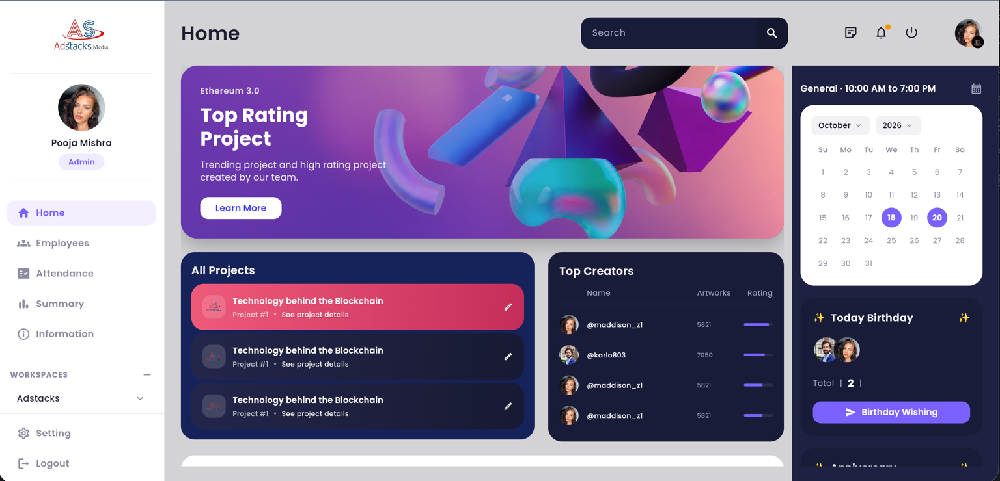

# AdStacks Media Dashboard

A modern and responsive Flutter Web Dashboard built as part of a Flutter UI assignment. The application focuses on clean architecture, reusable widgets, responsive layouts, and pixel-perfect implementation based on the provided design.

## 🌐 Live Demo

https://intern-1d35d.web.app

---


## ✨ Features

- Responsive Dashboard UI
- Modern Sidebar Navigation
- Interactive Top Navigation Bar
- Project Overview Cards
- Top Creators Analytics
- Calendar Section
- Birthday & Anniversary Widgets
- Performance Analytics Chart
- Reusable Components
- Clean Folder Structure

---

## 📸 Screens

### Dashboard
- Project Summary
- Creator Statistics
- Performance Overview
- Calendar Management
- Employee Highlights

---

## 🛠 Tech Stack

- Flutter
- Dart
- Material Design
- Google Fonts
- fl_chart

---

## 📂 Project Structure

```text
lib/
│
├── core/
│   ├── theme/
│   └── constants/
│
├── features/
│   └── dashboard/
│       ├── data/
│       ├── models/
│       ├── screens/
│       └── widgets/
│
└── main.dart
```

---

## 🚀 Getting Started

### Clone Repository

```bash
git clone https://github.com/rahulkumarsah1999/dashboard.git
```

### Install Dependencies

```bash
flutter pub get
```

### Run Application

```bash
flutter run
```

### Build Web Version

```bash
flutter build web
```

---

## 📱 Responsive Design

The dashboard is optimized for:

- Desktop
- Tablet
- Mobile Screens

---

## 🎯 Assignment Objectives

- Pixel-perfect UI implementation
- Reusable widget architecture
- Responsive layout support
- Clean code practices
- Flutter best practices

---

## 📸 Dashboard Preview

<p align="center">
  
</p>


## 👨‍💻 Developer

### Rahul Kumar Sah

Flutter Developer

🌐 Portfolio  
https://www.rahulkumarsah.com

💼 LinkedIn  
https://www.linkedin.com/in/rahulkumarsah

🐙 GitHub  
https://github.com/rahulkumarsah1999

---

## 📄 License

This project was developed for educational and assignment purposes.
